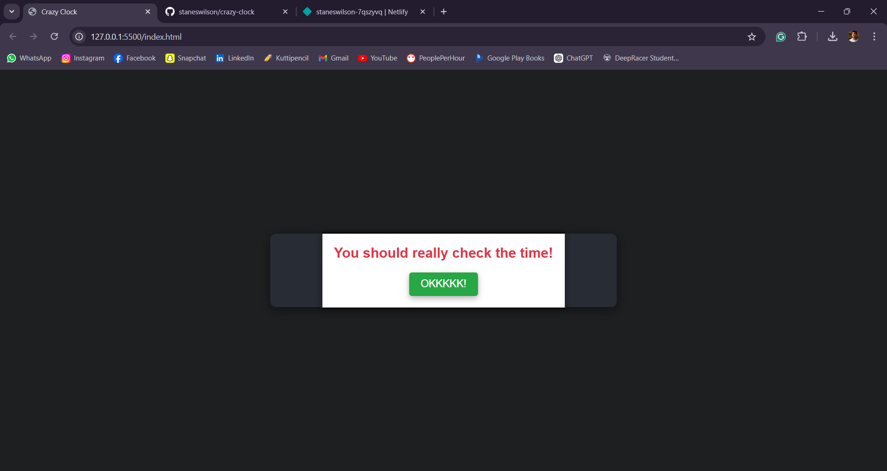

# Crazy Clock ⏰
### Demo: https://crazyclock.netlify.app/

## Basic Details
### Team Name: Stanes Wilson's Team


### Team Members
- Team Lead: Stanes Wilson - Jyothi Engineering College

### Project Description
A Crazy clock which shows CURRENT TIME

### The Problem
People spend lots of time in browsing useless things when the features are already in their hands.

### The Solution
The code will asks whether the user needs to know time and if yes it reminds the user about the clock in the status bar!

## Technical Details
### Technologies/Components Used
- HTML
- CSS
- JavaScript

### Implementation
For Software:
# Installation
1. Clone the repository:
   ```sh
   git clone https://github.com/staneswilson/crazy-clock.git
   ```
2. Navigate to the project directory:
   ```sh
   cd crazy-clock
   ```

# Run
Run index.html or open it in the browser.


# Screenshots
Initial prompt asking if the user needs to know the time.


Popup displayed when the user clicks "No," compelling them to check the time.


Animated clock displayed after the popup is closed.


---
Made with ❤️ at TinkerHub Useless Projects 


